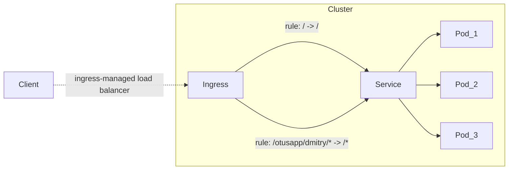

# Homework

Basics of working with Kubernetes.

### Task

Learn how to create a minimal service.

### Description

Create a minimal service that meets the requirements:

1. Service responds on port 8000;
2. The service has an HTTP method **GET /health/** with a response:

```json
{
  "status": "OK"
}
```

3. The service must be packaged in a **Docker** container and push the image
   to **[DockerHub](https://hub.docker.com/)**;

4. Write deployment manifests in **k8s** for the service:
    1. The manifests must describe entities **Deployment**, **Service**, **Ingress**;
    2. The **Deployment** can contain **Liveness**, **Readiness** probes;
    3. The number of replicas must be at least 2;
    4. The **Image** of the container must be specified with **[DockerHub](https://hub.docker.com/)**;
    5. The host in **Ingress** must be **arch.homework**.

As a result, after applying the manifests, a GET request to http://arch.homework/health should return JSON:

```json
{
  "status": "OK"
}
```

Provide output:

1. The link to [GitHub](https://github.com/) with manifests. The manifests must be in the same directory
   so that they can all be applied with a single `kubectl apply -f` command.

2. The URL where you can get a response from the service (or a test in Postman).

### Task with a star (+5 points)

The **Ingress** should have a rule that forwards all requests from **/otusapp/{student name}/*** to
service with path rewrite, where **{student name}** is the name of the student.

## Solution

According to the task, the cluster consists of three entities:

* **Deployment**
* **Service**
* **Ingress**

Flow diagram:



Routing rules:

1. The request to the root `/` does not change;
2. Request prefixed with `/otusapp/dmitry/*` is rewritten in favor of `/*`;
3. All other requests return 404.

## Manual

1. Download project to a pre-created directory:
```shell
git clone https://github.com/DmitryPrigozhaev/otus-microservice-architecture.git .
```
2. Start kubernetes in Docker with `minikube`:
```shell
minikube start --driver=docker
```
3. Install the [nginx ingress controller](https://kubernetes.github.io/ingress-nginx/deploy/):
```shell
kubectl apply -f https://raw.githubusercontent.com/kubernetes/ingress-nginx/controller-v1.3.0/deploy/static/provider/cloud/deploy.yaml
```
4. Create a new namespace via `kubectl`:
```shell
kubectl create namespace otus
```
5. Apply all homework manifests via `kubectl`:
```shell
kubectl apply -f /homework_1/
```
6. Deal with it!
```shell
curl arch.homework/health
```

---

# Bonus

## Useful tricks

Automatic input completion for `kubectl`:

#### BASH

```shell
source <(kubectl completion bash) # set up autocompletion in the current bash session, the bash-completion package must first be installed.
echo "source <(kubectl completion bash)" >> ~/.bashrc # add autocomplete permanently to the bash shell.
```

#### ZSH

```shell
source <(kubectl completion zsh) # set up autocompletion in the current zsh session
echo "[[ $commands[kubectl] ]] && source <(kubectl completion zsh)" >> ~/.zshrc # add autocomplete permanently to the zsh shell.
```

See more: https://kubernetes.io/ru/docs/reference/kubectl/cheatsheet/

## Monitoring

Use `minikube` dashboards for system monitoring:

```shell
minikube dashboard & disown
```