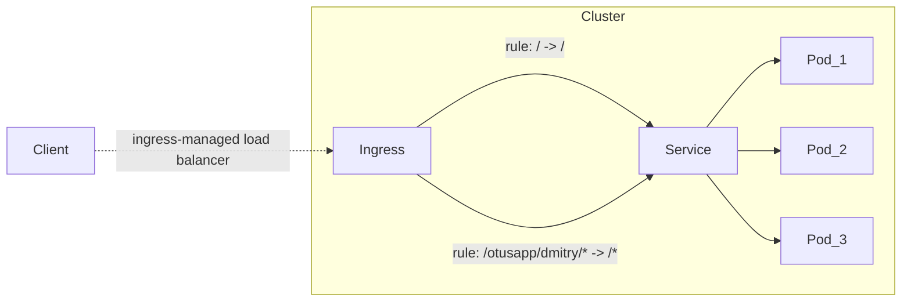

# Lesson 2

Basic Kubernetes entities: `Pod`, `ReplicaSet`, `Deployment`

### Task

1. Create a minimal service that meets the requirements:

   1. Service responds on port `8000`;
   2. Service has an HTTP method `GET /health/` with a response:

   ```json
   {
     "status": "OK"
   }
   ```

2. The service must be packaged in a **Docker** container and push the image
   to **[DockerHub](https://hub.docker.com/)**;

3. Write deployment manifests in **k8s** for the service:
   1. Manifests must describe entities **Deployment**, **Service**, **Ingress**;
   2. **Deployment** can contain **Liveness**, **Readiness** probes;
   3. Number of replicas must be at least 2;
   4. **Image** of the container must be specified with **[DockerHub](https://hub.docker.com/)**;
   5. Host in **Ingress** must be **arch.homework**.
   6. As a result, after applying the manifests, a GET request to http://arch.homework/health should return JSON:

      ```json
      {
        "status": "OK"
      }
      ```

### Provide output:

1. Link to [GitHub](https://github.com/) with manifests. The manifests must be in the same
   directory so that they can all be applied with a single `kubectl apply -f` command;
2. URL to get service response.

### Task with a star (+5 points)

**Ingress** should have a rule that forwards all requests from **/otusapp/{student name}/*** to
service with path rewrite, where **{student name}** is the name of the student.

## Solution

According to the task, the cluster consists of three entities:

* **Deployment**
* **Service**
* **Ingress**

Flow diagram:



Routing rules:

1. The request to the root `/` does not change;
2. Request prefixed with `/otusapp/dmitry/*` is rewritten in favor of `/*`;
3. All other requests return 404.

## Guide

### Preconditions

1. Docker installed;
2. Gradle installed;
3. Kubectl installed:
   1. Install the `kubectl` in any way possible (if required). Linux Mint [example](https://kubernetes.io/ru/docs/tasks/tools/install-kubectl/#%D1%83%D1%81%D1%82%D0%B0%D0%BD%D0%BE%D0%B2%D0%BA%D0%B0-kubectl-%D0%B2-linux):

      ```shell
      # download latest version
      curl -LO https://storage.googleapis.com/kubernetes-release/release/`curl -s https://storage.googleapis.com/kubernetes-release/release/stable.txt`/bin/linux/amd64/kubectl
      
      # make binary executable
      chmod +x ./kubectl
      
      # move the binary to the directory from the PATH environment variable
      sudo mv ./kubectl /usr/local/bin/kubectl
      
      # make sure the latest version is installed
      kubectl version --client
      ```

4. Minikube installed:
   
   1. Install the `minikube` in any way possible (if required). Linux Mint [example](https://kubernetes.io/ru/docs/tasks/tools/install-minikube/):

      ```shell
      # download latest version
      curl -Lo minikube https://storage.googleapis.com/minikube/releases/latest/minikube-linux-amd64 && chmod +x minikube
      
      # making the minikube executable available from any directory
      sudo install minikube /usr/local/bin/
      
      # check cluster status
      minikube status
      ```

5. Helm installed:
   1. Install the `helm` in any way possible (if required). Linux Mint example via `snap`:

      ```shell
      # install helm
      snap install helm --classic
      
      # check helm version
      helm versoin
      ```

### Build project

1. Download project to a pre-created directory:

   ```shell
   git clone https://github.com/DmitryPrigozhaev/otus-microservice-architecture.git
   ```

2. Build project:

   ```shell
   gradle build
   ```

### Publish Docker image

1. Create local docker image with name "lesson_2" in repository "dmitryprigozhaev":

   ```shell
   docker build -t dmitryprigozhaev/lesson_2:latest .
   ```

2. Push image to repository:

   ```shell
   docker push dmitryprigozhaev/lesson_2:latest
   ```

### Run an Application in a Cluster

1. Configure `minikube`:

   ```shell
   # start kubernetes in Docker with `minikube`
   minikube start --driver=docker
   minikube tunnel & disown
   ```

2. Download project to a pre-created directory:

   ```shell
   git clone https://github.com/DmitryPrigozhaev/otus-microservice-architecture.git .
   ```

3. Install the nginx ingress controller via `helm`:
   
   ```shell
   # otus-lesson-2-nginx-ingress.yaml is available in the project
   kubectl create namespace m && \ 
     helm repo add ingress-nginx https://kubernetes.github.io/ingress-nginx/ && \ 
     helm repo update && \ 
     helm install nginx ingress-nginx/ingress-nginx --namespace m \
     -f otus-microservice-architecture/lesson_2/helm/otus-lesson-2-nginx-ingress.yaml
   ```

4. Create a new namespace via `kubectl`:

   ```shell
   kubectl create namespace otus
   ```
   
5. Apply all manifests via `kubectl`:

   ```shell
   kubectl apply -f otus-microservice-architecture/lesson_2/k8s/
   ```

6. Deal with it!
   ```shell
   curl arch.homework/health
   ```

## Cleanup Lesson 2 cluster 

   ```shell
   # clear namespaces
   kubectl delete --all namespace m otus
   
   # clear minikube
   minikube delete --all --purge 
   ```
