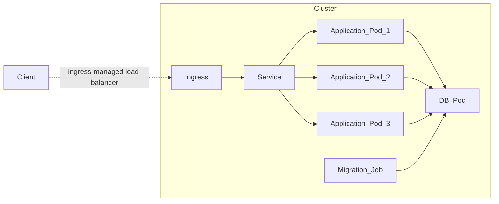

# Lesson 3

Basic Kubernetes entities: `Service`, `Ingress`

### Task

1. Create a simple RESTful CRUD to create, delete, view and update users.
   API example: https://app.swaggerhub.com/apis/otus55/users/1.0.0
2. Add a database for the application;
3. Application configuration must be stored in `Configmaps`;
4. Database access must be stored in `Secrets`;
5. Initial migrations should be documented as `Jobs`, if required.
6. `Ingresses` should also lead to the url `arch.homework/`.

### Provide output:

1. Link to [GitHub](https://github.com/) with manifests;
2. Application launch manual;
3. Command to install the database from helm, along with the `values.yaml` file;
4. Command to apply initial migrations the `kubectl apply -f` command, which runs the kubernetes manifests
   in the correct order;
5. Postman collection, which will provide examples of requests to the service to create, get,
   change and delete a user. Important: in the postman collection, use the base `arch.homework` url.

### Task with a star (+5 points)

+5 points for app templating in helm charts.

# Solution

According to the task, the cluster contains the basic entities: `Service` and `Ingress`

The service consists of three pods of the simplest CRUD application with a common database.

Flow diagram:



# Guide

### Preconditions

1. Docker installed;

2. Gradle installed;

3. Kubectl installed:

   1. Install the `kubectl` in any way possible (if required). Linux Mint [example](https://kubernetes.io/ru/docs/tasks/tools/install-kubectl/#%D1%83%D1%81%D1%82%D0%B0%D0%BD%D0%BE%D0%B2%D0%BA%D0%B0-kubectl-%D0%B2-linux):

      ```shell
      # download latest version
      curl -LO https://storage.googleapis.com/kubernetes-release/release/`curl -s https://storage.googleapis.com/kubernetes-release/release/stable.txt`/bin/linux/amd64/kubectl
      
      # make binary executable
      chmod +x ./kubectl
      
      # move the binary to the directory from the PATH environment variable
      sudo mv ./kubectl /usr/local/bin/kubectl
      
      # make sure the latest version is installed
      kubectl version --client
      ```

4. Minikube installed:

   1. Install the `minikube` in any way possible (if required). Linux Mint [example](https://kubernetes.io/ru/docs/tasks/tools/install-minikube/):

      ```shell
      # download latest version
      curl -Lo minikube https://storage.googleapis.com/minikube/releases/latest/minikube-linux-amd64 && chmod +x minikube
      
      # making the minikube executable available from any directory
      sudo install minikube /usr/local/bin/
      
      # check cluster status
      minikube status
      ```

5. Helm installed:

   1. Install the `helm` in any way possible (if required). Linux Mint example via `snap`:

      ```shell
      # install helm
      snap install helm --classic
      
      # check helm version
      helm versoin
      ```

### Build project

1. Download project to a pre-created directory:

   ```shell
   git clone https://github.com/DmitryPrigozhaev/otus-microservice-architecture.git
   ```

2. Build project:

   ```shell
   gradle build
   ```

### Publish Docker image

1. Create local docker image with name "lesson_3" in repository "dmitryprigozhaev":

   ```shell
   docker build -t dmitryprigozhaev/lesson_3:latest .
   ```

2. Push image to repository:

   ```shell
   docker push dmitryprigozhaev/lesson_3:latest
   ```

### Run an Application in a Cluster

1. Configure `minikube`:

   ```shell
   # start kubernetes in Docker with `minikube`
   minikube start --driver=docker
   minikube tunnel & disown
   ```

2. Install the nginx ingress controller via `helm`:

   ```shell
   # otus-lesson-3-nginx-ingress.yaml is available in the project
   kubectl create namespace m && \ 
     helm repo add ingress-nginx https://kubernetes.github.io/ingress-nginx/ && \ 
     helm repo update && \ 
     helm install nginx ingress-nginx/ingress-nginx --namespace m \
     -f otus-microservice-architecture/lesson_3/helm/ingress/otus-lesson-3-nginx-ingress.yaml
   ```

3. Create namespace:

   ```shell
   kubectl create namespace otus
   ```

4. Run application via helm:

   1. Update dependencies, in particular, load the database image for the chart:
   
      ```shell
      helm dependency update otus-microservice-architecture/lesson_3/helm
      ```

   2. Examine a chart for possible issues:

      ```shell
      helm lint otus-microservice-architecture/lesson_3/helm
      ```
      
   3. Install the chart:

      ```shell
      helm install lesson3 otus-microservice-architecture/lesson_3/helm
      ```

5. Deal with it!

   ```shell
   curl arch.homework/health
   ```
   
### Cleanup Lesson 3

1. Cleanup cluster:

   ```shell
   helm delete lesson_3
   ```
2. Clear namespaces:

   ```shell
   kubectl delete --all namespace m otus
   ```

3. Clear the minikube:

   ```shell
   minikube delete --all --purge 
   ```
