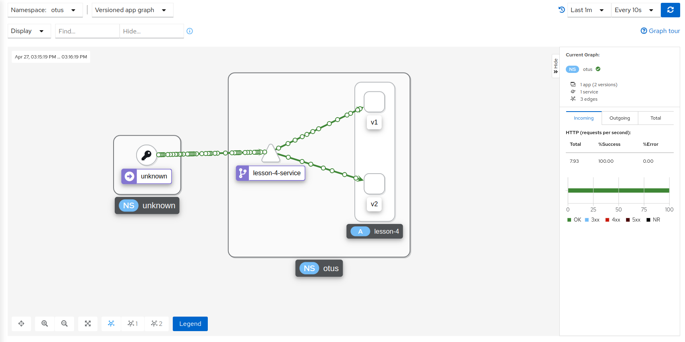

# Lesson 4

Deploy two versions of the application in a cluster and configure traffic
balancing between them.

### Task

Detailed description of the task: https://github.com/izhigalko/otus-homework-istio

1. Deploy Minikube;
2. Deploy [Istio](https://istio.io/) with Ingress gateway;
3. Deploy two versions of an application using [Istio](https://istio.io/);
4. Set up traffic balancing between application versions at the Gateway level 50% to 50%;

### Provide output

1. Take a screenshot of the service map in [Kiali](https://kiali.io/) with examples of calling two versions of the
   service.

# Solution

The result of the lesson is a 50/50 traffic split between the two resources:



# Guide

### Preconditions

1. Docker installed;

2. Gradle installed;

3. Kubectl v1.19.0 installed:

    1. Install the `kubectl` in any way possible (if required). Linux Mint via `snap`:

       ```shell
       # download specific version:
       sudo snap install kubectl --channel=1.19/stable --classic
       
       # make sure the specific version is installed:
       kubectl version --client
       ```

4. Minikube installed:

    1. Install the `minikube` in any way possible (if required). Linux
       Mint [example](https://kubernetes.io/ru/docs/tasks/tools/install-minikube/):

       ```shell
       # download latest version
       curl -Lo minikube https://storage.googleapis.com/minikube/releases/latest/minikube-linux-amd64 && chmod +x minikube
       
       # making the minikube executable available from any directory
       sudo install minikube /usr/local/bin/
       
       # check cluster status
       minikube status
       ```

5. Helm v3.3.4 installed:

    1. Install the `helm` in any way possible (if required). Linux Mint example via `snap`:

       ```shell
       # install helm
       snap install helm --channel=3.3/stable --classic
       
       # check helm version
       helm versoin
       ```

6. Istio v1.7.3 installed:

    1. Install the `istio` in any way possible (if required). Linux Mint example:

        ```shell
        # download the specified release with the command:
        curl -L https://istio.io/downloadIstio | ISTIO_VERSION=1.7.3 TARGET_ARCH=x86_64 sh -
       
        # move istio to the hidden directory:
        mv ~/istio-1.7.3 ~/.istioctl

        # add the istioctl client to path variable:
        export PATH=$HOME/.istioctl/bin:$PATH
        ```

### Build project

1. Download project to a pre-created directory:

   ```shell
   git clone https://github.com/DmitryPrigozhaev/otus-microservice-architecture.git
   ```

2. Build project:

   ```shell
   gradle build
   ```

### Publish Docker image

1. Create local docker image with name "lesson_4" in repository "dmitryprigozhaev":

   ```shell
   docker build -t dmitryprigozhaev/lesson_4:latest .
   ```

2. Push image to repository:

   ```shell
   docker push dmitryprigozhaev/lesson_4:latest
   ```

### Run an Application in a Cluster

1. Configure `minikube`:

    ```shell
    # start kubernetes v1.19.0 in Docker with `minikube`:
    minikube start --driver=docker --cpus=4 --memory=8g --cni=flannel --kubernetes-version="v1.19.0"
    minikube tunnel & disown
    ```

2. Create namespaces:

    ```shell
    # create operators namespaces:
    kubectl apply -f otus-microservice-architecture/lesson_4/namespaces.yaml
    ```

3. Deploy [Jaeger](https://www.jaegertracing.io/):

    1. Add a repository to helm:

        ```shell
        helm repo add jaegertracing https://jaegertracing.github.io/helm-charts
        helm repo update
        ```

    2. Install operator that deploys Jaeger:

        ```shell
        helm install --version "2.19.0" -n \
            jaeger-operator -f otus-microservice-architecture/lesson_4/jaeger/operator-values.yaml \
            jaeger-operator jaegertracing/jaeger-operator
        ```

    3. Deploy Jaeger:

        ```shell
        kubectl apply -f otus-microservice-architecture/lesson_4/jaeger/jaeger.yaml
        ```

    4. Check Jaeger:

        ```shell
        kubectl get pod -n jaeger -l app.kubernetes.io/instance=jaeger
        ```

    5. Open the Jaeger web interface:

        ```shell
        minikube service -n jaeger jaeger-query-nodeport
        ```

    See more: https://www.jaegertracing.io/docs/1.24/operator/

4. Deploy [Prometheus](https://prometheus.io/):

    1. Add a repository to helm:

        ```shell
        helm repo add prometheus-community https://prometheus-community.github.io/helm-charts
        helm repo add stable https://charts.helm.sh/stable
        helm repo update
        ```

    2. Deploy a monitoring solution based on Prometheus:

        ```shell
        helm install --version "13.7.2" -n \
            monitoring -f otus-microservice-architecture/lesson_4/prometheus/operator-values.yaml \
            prometheus prometheus-community/kube-prometheus-stack
        ```

    3. Check the status of monitoring components:

        ```shell
        kubectl get pods -n monitoring
        ```

    4. Add a NodePort type service for direct access to Prometheus and Grafana:

        ```shell
        kubectl apply -f otus-microservice-architecture/lesson_4/prometheus/monitoring-nodeport.yaml
        ```

    5. Open the Grafana web interface:

        ```shell
        minikube service -n monitoring prometheus-grafana-nodeport
        ```

    6. Open the Prometheus web interface:

        ```shell
        minikube service -n monitoring prom-prometheus-nodeport
        ```

5. Deploy [Istio](https://istio.io/):

    1. Install Istio unwrapping statement:

        ```shell
        istioctl operator init --watchedNamespaces istio-system --operatorNamespace istio-operator
        ```

    2. Deploy Istio using the operator:

        ```shell
        kubectl apply -f otus-microservice-architecture/lesson_4/istio/istio.yaml
        ```

    3. Check Istio:

        ```shell
        kubectl get all -n istio-system -l istio.io/rev=default
        ```
       
        **Attention!**

       At this point, there may be a problem with assigning an external IP
       for the `istio-ingressgateway` service. For a `minikube`, the next
       command can help:

        ```shell
        minikube tunnel
        ```

    4. Set default settings:

        ```shell
        kubectl apply -f otus-microservice-architecture/lesson_4/istio/disable-mtls.yaml
        ```

6. Deploy [Kiali](https://kiali.io/):

    1. Add a repository to helm:

        ```shell
        helm repo add kiali https://kiali.org/helm-charts
        helm repo update
        ```

    2. Install Kiali Operator deploying Kiali:

        ```shell
        helm install --version "1.33.1" -n kiali-operator \
            -f otus-microservice-architecture/lesson_4/kiali/operator-values.yaml \
            kiali-operator kiali/kiali-operator
        ```

    3. Deploy Kiali:

        ```shell
        kubectl apply -f otus-microservice-architecture/lesson_4/kiali/kiali.yaml
        ```

    4. Check Kiali:

        ```shell
        kubectl get pods -n=kiali -l app.kubernetes.io/name=kiali
        ```

    5. Open the Kiali web interface:

        ```shell
        minikube service -n kiali kiali-nodeport
        ```

7. Deploy application:

    1. Apply all manifests via `kubectl`:

        ```shell
        kubectl apply -f otus-microservice-architecture/lesson_4/k8s/
        ```
       
    2. Check application health:

        ```shell
        curl $(minikube -n otus service lesson-4-service --url)/health
        ```

8. Launch traffic:

    ```shell
    watch -n 0.1 curl $(minikube -n otus service lesson-4-service --url)/health
    ```
   
9. Deal with it: see the Kialy dashboard.
